# Read It

This web application is for users to share and read posts related to different subjects (forums).  Often this can be a replacement for a
blog for standalone forum

### Installation
1. Download/clone the code package
2. Composer install dependencies - 'composer update'
3. Copy .env.example, create new file called .env
4. run 'php artisan key:generate'
5. Start web server PHP/MySQL
6. Create database for project
7. Update .env file with MySQL settings
8. Update .env file with APP_URL
    1. (default is http://localhost, may need to change to index URL when 'php artisan serve' e.g. http://127.0.0.1)
9. run 'php artisan migrate:fresh'
10. run 'php artisan dusk:install'
    1. delete ExampleTest.php from /tests/Browser as it will fail
11. Create 'Unit' folder in /tests
12. run 'php artisan serve'
13. (in another terminal instance as website needs to be running) run 'php artisan test && php artisan dusk'
14. If tests are passed, the test data can be replaced using 'php artisan migrate:fresh --seed' 
15. If database is seeded as above, test user account details are:
    1. email => 'admin@email.com'
    2. password => 'password'

### Features

The user is greeted by the dashboard page whether logged in or not.
If the current user is a guest they will not be able to use any other part of the website

Forums can be created by all users, but can only be edited/deleted by the user that created them
Posts can be created by all users, but can only be edited/deleted by the user

To see all current users' posts, you can select the dropdown on the top right and click 'My Posts'

The Posts tab contains all posts in reverse order, like a feed

The Forums tab contain all active forums, as well as forums that were created by the current user
(If only active forums were shown, it would be difficult to make a forum active)

If a user selects a forum from the forums tab they will be shown all posts written in that forum

### Usage Instructions

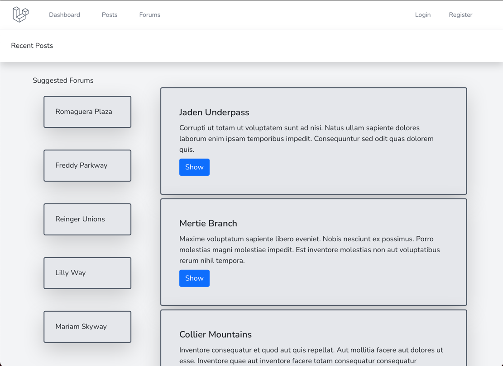

The website opens on the dashboard view, because there is no user logged in there are **Login** and **Register** links in the top right

The functionality when not logged in is limited, the user will be redirected to the login screen if they try to open a post or click any link 
(other than **Dashboard** or **Register**)

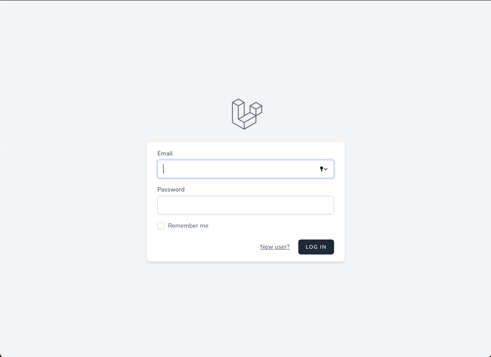

You can login using the admin details in the final step of the installation above 
or click the **'New User?'** or **Register** links to create your own account

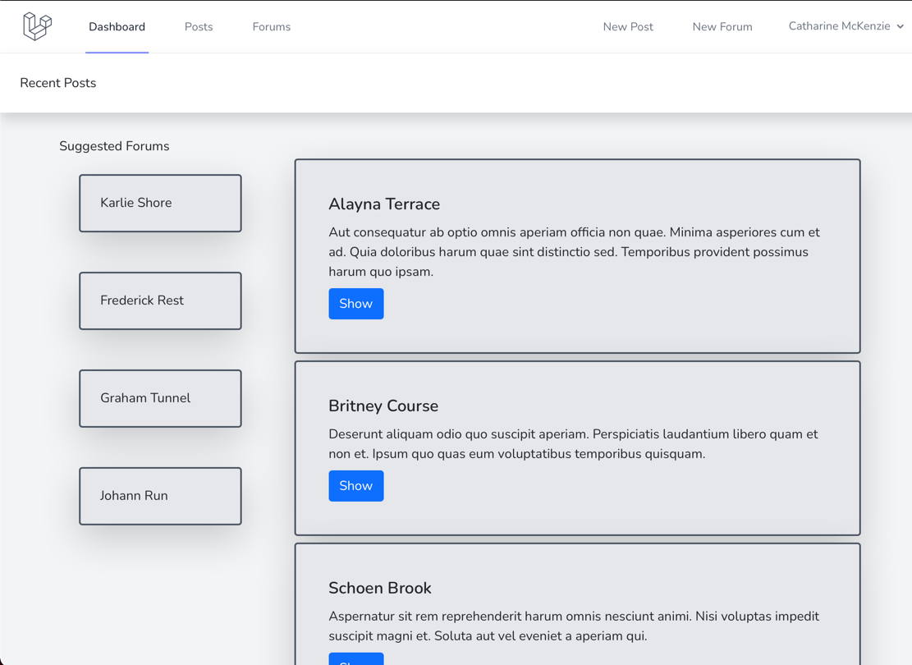

Now you have the ability to access all features, you can view a full post by clicking **Show**

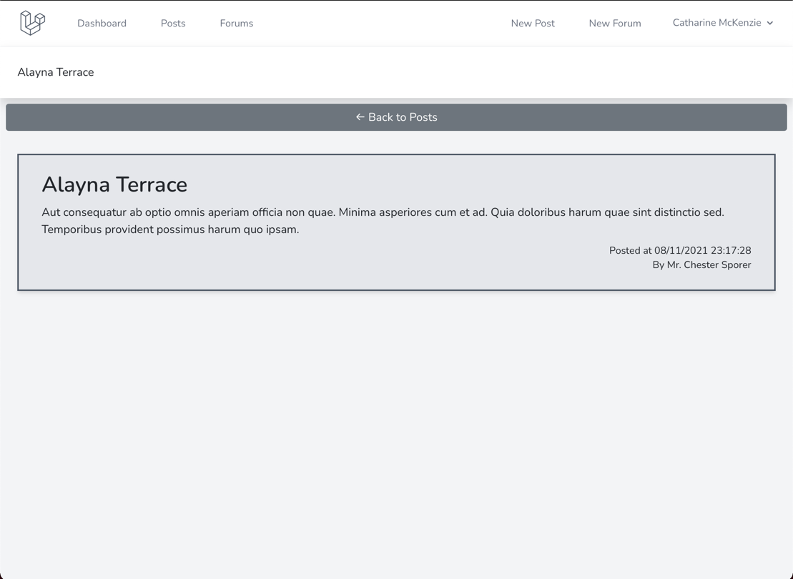

You can create a new post by clicking **New Post** in the nav bar, or a New Post button in the posts and forums views

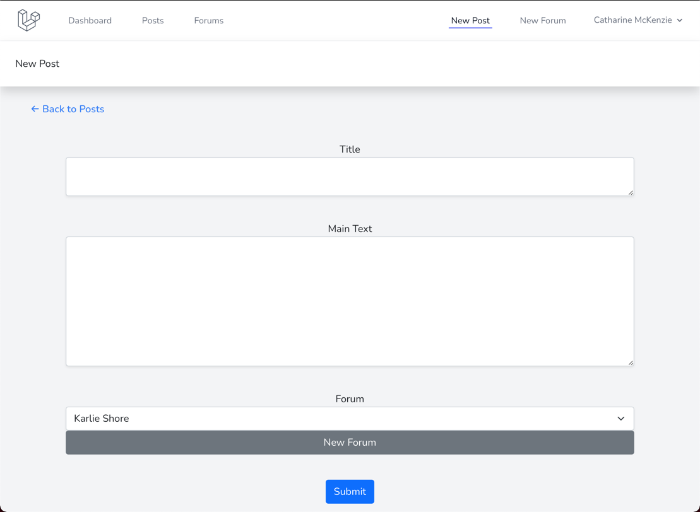

Create a new forum using the **New Forum** nav link or button

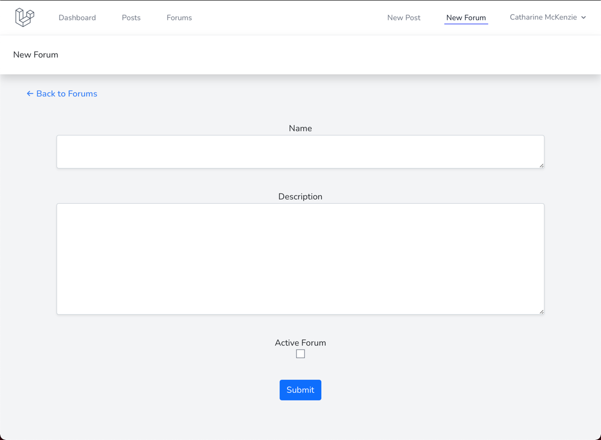

Access your own posts by clicking on the dropdown in the top right

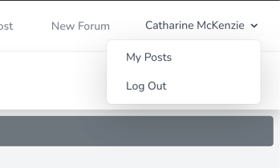

And clicking **My Posts**

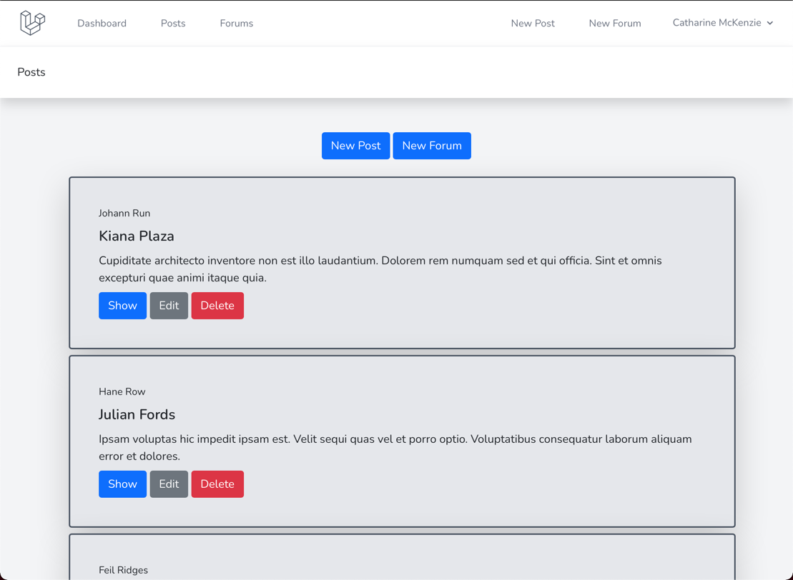

This shows the post that belong to the current user, and allow the posts to be edited or deleted.
These options can also be found in the posts view and within forums

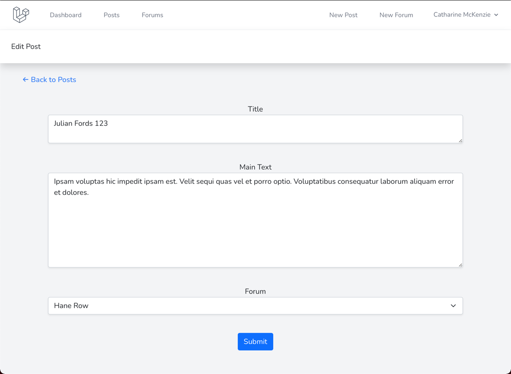

The **Posts** nav link takes the user to the Posts.View view with the 100 most recent posts

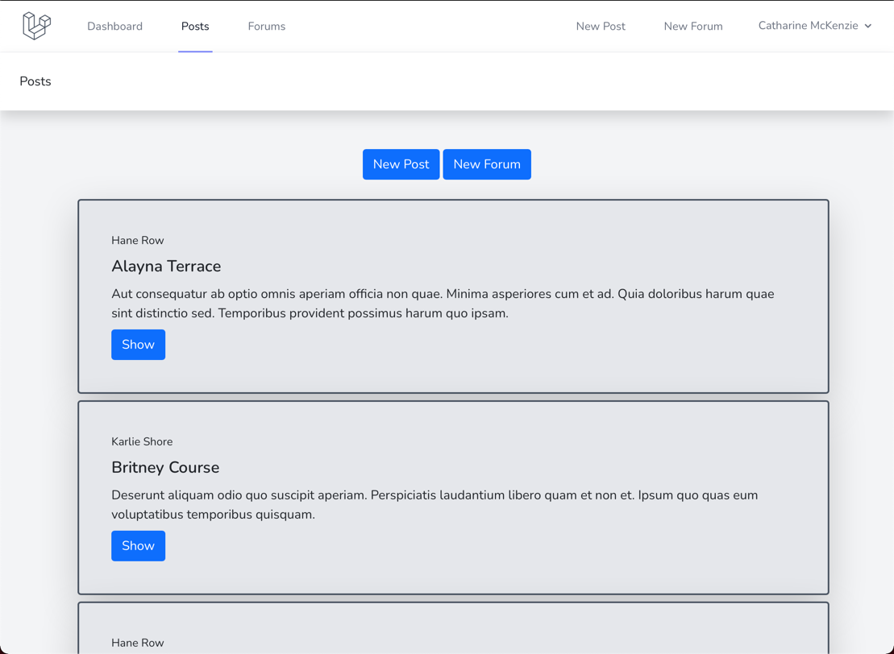

A new post or forum can be created by the nav bar links at the top, or the buttons at the top of this page, as well as a few others

The **Forums** nav link takes the user to Forums.View, which displays active forums as well as the forums belonging to the user

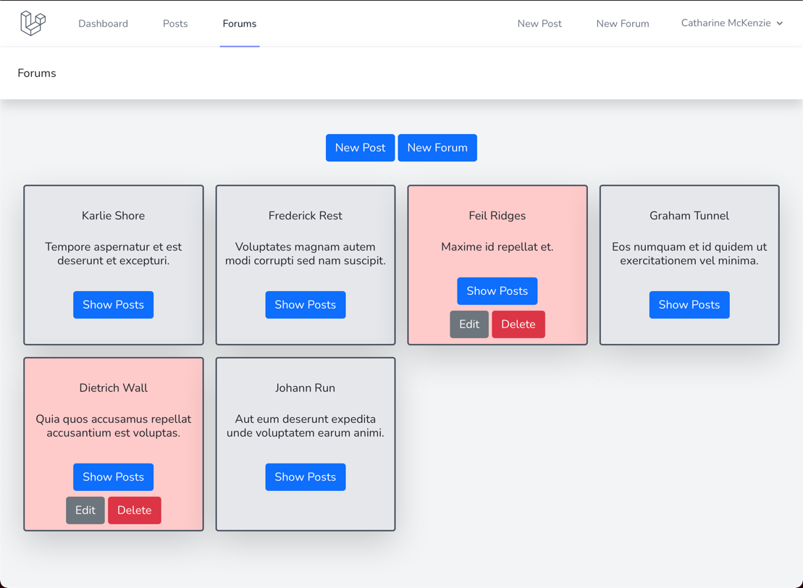

This page allows the forums to be visited, by pressing the show button you can see all posts in that forum

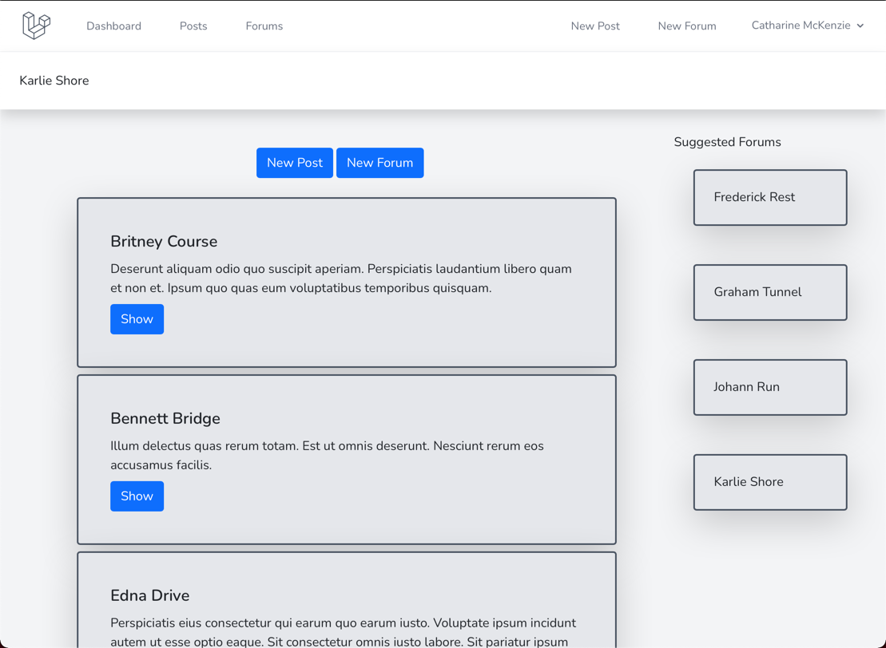

The owner of the forum can also edit (name, description, active status) or delete the forum in this view

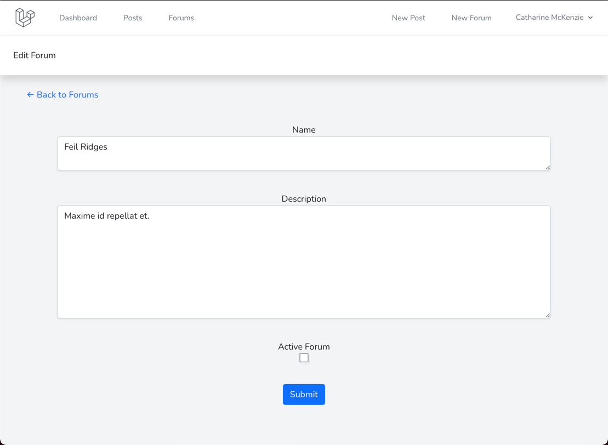

This forum is currently inactive, as shown by the red background of the forum's card in the forums view and the unticked 'Active Forum' checkbox

To log out, click the **Log Out** link in the dropdown in the top right of the screen

### Future Plans

1. Forum creators can add admins/moderators to their forums
   1. Allow creators, admins & moderators to delete posts in said forum
   2. Creator/admin can edit forum info or mark as active/inactive
2. Allow users to like/save/comment on posts 
   1. Like/save on all posts
   2. Only allow comments on posts in forums the user is a part of
3. Allow replies to comments
4. Allow users to join forums instead of user being in all forums on account creation
5. Allow forums (and by extension the posts in them) to be private until user is accepted to the forum
6. Events/notifications to keep track of the above?
7. Update UI
8. Add email functionality for registering and resetting forgotten password
9. Infinite scroll instead of pagination
10. Add featured posts, forums (most popular) to dashboard
11. Differentiate more between Dashboard, Posts.View and Forums.Show

### Current Bugs

1. Deleting a post in 'My Posts' returns to route('posts.index') instead of posts.personal
2. Editing a post in 'My Posts' returns to the Post.Show View, but when you press 'Back to Posts', it returns to route('posts.index') instead of posts.personal

